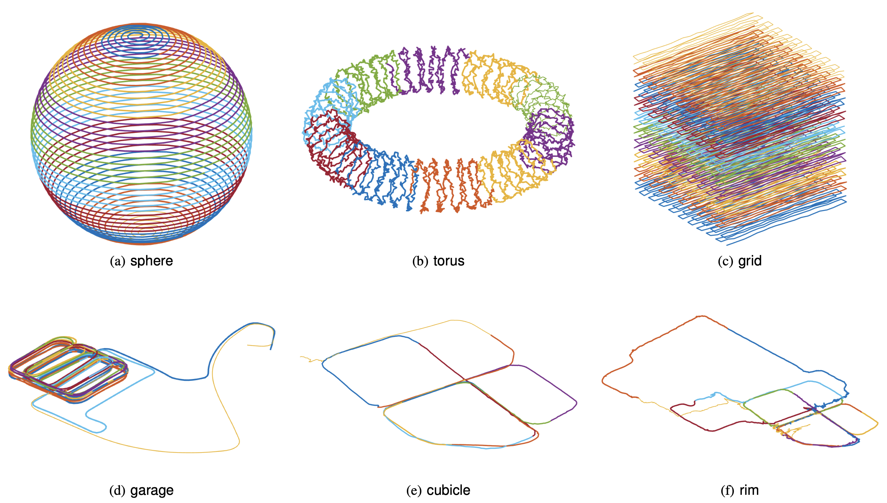

<h1 align="center">
    Majorization Minimization Methods for Distributed Pose Graph Optimization
</h1>

<p align="justify">
Official implementation of <a href="https://arxiv.org/abs/2108.00083">Majorization Minimization Methods for Distributed Pose Graph Optimization</a>. Taosha Fan and Todd Murphey. In IEEE Transactions on Robotics (T-RO), 2024.
</p>

<p align="center">
    
</p>

<p align="justify">
We consider the problem of distributed pose graph optimization (PGO) that has important applications in multirobot simultaneous localization and mapping (SLAM). We propose the majorization minimization (MM) method for distributed PGO ( MM--PGO ) that applies to a broad class of robust loss kernels. The MM--PGO method is guaranteed to converge to first-order critical points under mild conditions. Furthermore, noting that the MM--PGO method is reminiscent of proximal methods, we leverage Nesterov's method and adopt adaptive restarts to accelerate convergence. The resulting accelerated MM methods for distributed PGO—both with a master node in the network ( AMM--PGO∗ ) and without ( AMM--PGO# )—have faster convergence in contrast to the MM--PGO method without sacrificing theoretical guarantees. In particular, the AMM--PGO# method, which needs no master node and is fully decentralized, features a novel adaptive restart scheme and has a rate of convergence comparable to that of the AMM--PGO∗ method using a master node to aggregate information from all the nodes. The efficacy of this work is validated through extensive applications to 2-D and 3-D SLAM benchmark datasets and comprehensive comparisons against existing state-of-the-art methods, indicating that our MM methods converge faster and result in better solutions to distributed PGO.
</p>

## Quickstart

#### Compile

```bash
git clone https://github.com/MurpheyLab/DPGO.git
cd DPGO
mkdir release
cd release
cmake -DCMAKE_BUILD_TYPE=Release ../C++
make -j16
```

#### Run

```bash
./bin/dist_pgo --dataset PATH_TO_DATASET --num_nodes NUM_NODES --iters 1000 --loss "trivial"  --save true --dist_init true
```

## Citation

If you find this work useful for your research, please cite our paper:

```
@article{fan2024mm_pgo,
	title={Majorization Minimization Methods for Distributed Pose Graph Optimization}, 
	author={Fan, Taosha and Murphey, Todd D.},
	journal={IEEE Transactions on Robotics}, 
	year={2024},
	volume={40},
	number={},
	pages={22-42}
}
```

## License
This project is licensed under [MIT License](./LICENSE).
